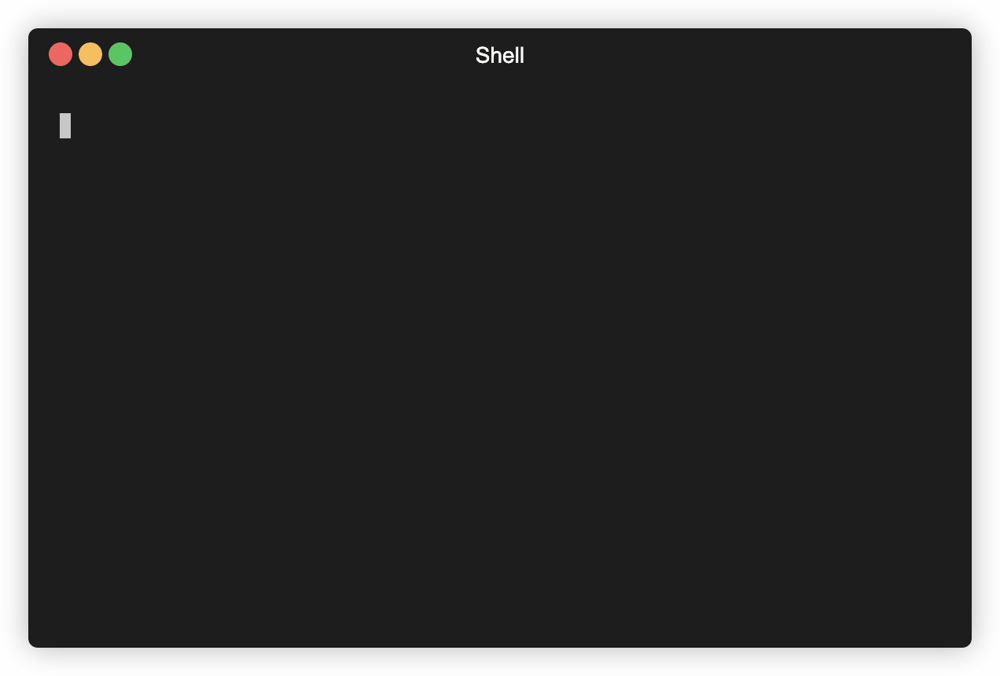

# Automedia

[](https://pypi.org/project/automedia/)

Automedia is a tool to manage bitrot and formats in large media libraries, whether it be audio or video.

The tool currently supports the following operations:

 * **Printing/logging to list media files**: view your media files at a glance
 * **Verification of media correctness via `ffmpeg`**: test-decoding of supported files to find bitrot
 * **Transcoding media libraries to other formats via `ffmpeg`**: archive your media in a lossless/high-quality format, transcode for daily use or for older devices
 * **PAR2 creation and verification**: prevent future bitrot of data at rest

## But why?

You can replace much of what this tool does using `find`, `xargs`, `grep` and a dash of scripting, but `automedia` deals with all of
the incantations itself and has some intelligence to handle interaction with complex tools like as `ffmpeg`.

## Requirements

`automedia` requires the `ffmpeg` and `par2` executables to be fully operational. These must exist on the path for the application to function. It is
recommended to use the dockerized version of this application as these requirements will be packaged up with it.

## Installation

`automedia` can be installed via pip, or can be run with all binary dependencies in a Docker container. 

### Via pip

Automedia is available as a `pip` package. You can download it with:

```bash
pip install automedia
automedia --help
```

### Via Docker

If you wish to run Automedia via Docker, a script has been provided that transparently runs Automedia on your machine as
if it were not running within a container (by mounting the entire root of your drive within the container).

This script may be copied to a directory on your local `$PATH` and will automatically invoke the appropriate Docker container.

```bash
cp automedia-docker /usr/local/bin/automedia
automedia --help
```

## Usage

Print a list of media files we find:

`automedia --root /media print`

Verify the media files we find using `ffmpeg`:

`automedia --root /media verify`

Transcode the media files from `/media` to `/mnt/usb_stick` to 64k AAC format:

`automedia --root /media transcode --preset aac-64k --output=/mnt/usb_stick`

Transcode the media files from `/media` to `/mnt/usb_stick` to FLAC format:

`automedia --root /media transcode --preset flac --output=/mnt/usb_stick`

Create PAR2 files for the media files we find:

`automedia --root /media par2-create`

Verify PAR2 files for the media files we find:

`automedia --root /media par2-verify`

## Screenshots


